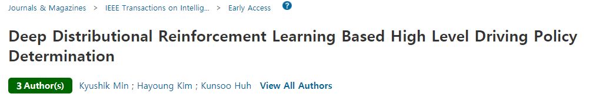
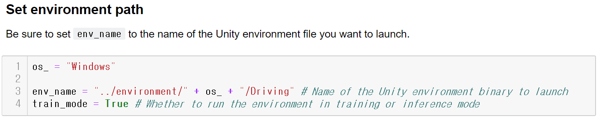
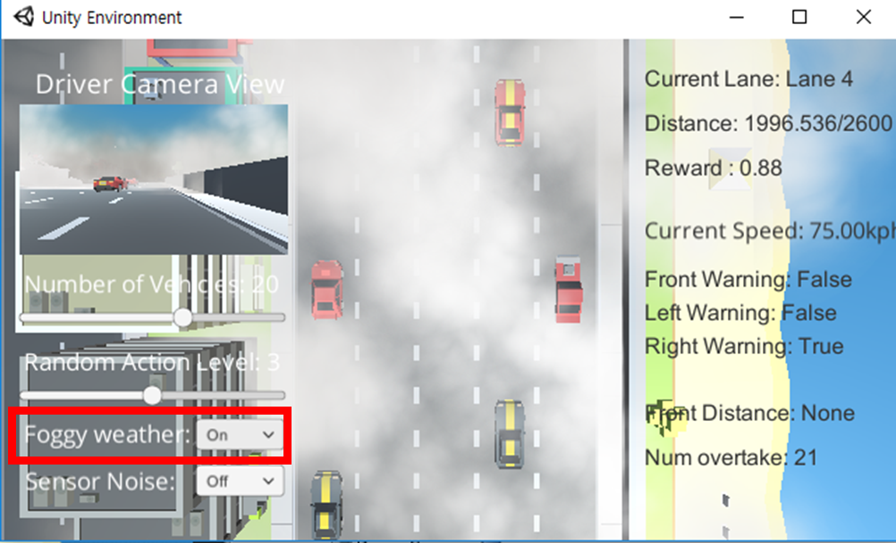
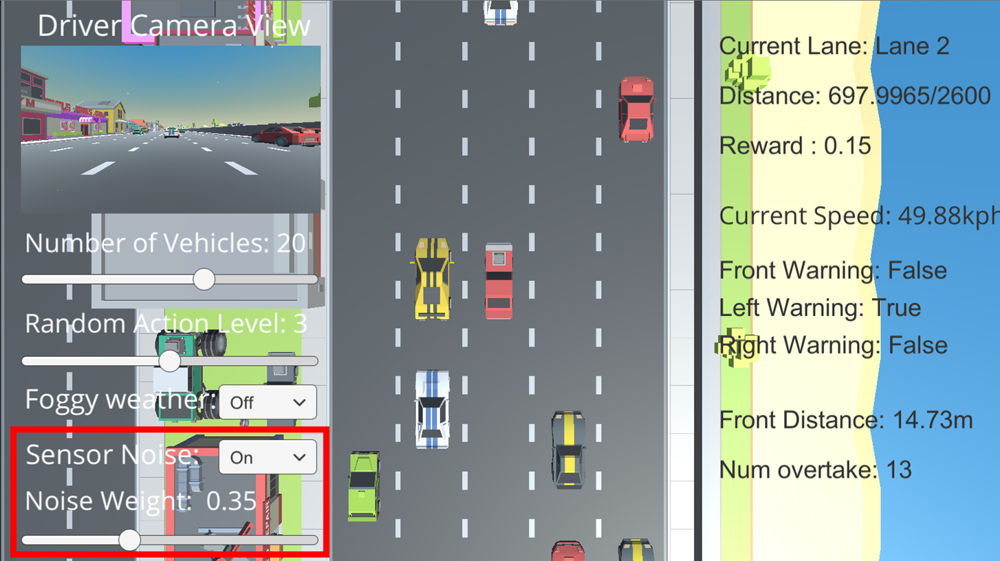

# DRL Based Self Driving Car Control

## Version 1.8

[Version information](https://github.com/MLJejuCamp2017/DRL_based_SelfDrivingCarControl/blob/master/Version_Info.md) of this project

[Unity Project](<https://github.com/MLJejuCamp2017/DRL_based_SelfDrivingCarControl/tree/master/Unity_SDK>) is provided! Please refer to the simulator section. 

---

## Introduction

[2018. 10. 22] Paper of this Project is accepted to Intelligent Vehicle Symposium 2018!! :smile: 

[2019. 05. 28] Paper of this Project is accepted to [IEEE Transactions on Intelligent Vehicles](https://ieeexplore.ieee.org/xpl/RecentIssue.jsp?punumber=7274857)!! 😄 

[IV2018 PPT](https://www.dropbox.com/s/tzv2dfo1qcmp64z/Kyushik_IEEE%20IV%202018%20presentation.pdf?dl=0)

[Link of IV2018 Paper](https://ieeexplore.ieee.org/document/8500645)

[Link of IEEE Transactions on Intelligent Vehicles Paper](<https://ieeexplore.ieee.org/abstract/document/8723635>)




---

This repository is for `Deep Reinforcement Learning Based Self Driving Car Control` project in [ML Jeju Camp 2017](http://mlcampjeju.com/)

There are 2 main goals for this project.

* Making vehicle simulator with [Unity ML-Agents](https://unity3d.com/kr/machine-learning).
* Control self driving car in the simulator with some safety systems.

  As a self driving car engineer, I used lots of `vehicle sensors`(e.g. RADAR, LIDAR, ...) to perceive environments around host vehicle. Also, There are a lot of `Advanced Driver Assistant Systems (ADAS)` which are already commercialized. I wanted to combine these things with my deep reinforcement learning algorithms to control self driving car.

Simple overview of my project is as follows. 


I will use sensor data and camera image as inputs of DRL algorithm. DRL algorithm decides action according to the inputs. If the action may cause dangerous situation, ADAS controls the vehicle to avoid collision. 


### Software and Hardware configuration of this project

**Software** 
* Windows10 (64bit)
* Python 3.6.5
* Anaconda 5.2.0
* Tensorflow 1.8.0

**Hardware**
* CPU: Intel(R) Core(TM) i7-4790K CPU @ 4.00GHZ

* GPU: GeForce GTX 1080 Ti

* Memory: 8GB


### How to Run this Project

1. download the github repo
2. open the ipynb file in the RL_algorithm folder 
3. Set the environment path and run it!

<br>

### Environment Path Setting



You should select os  between `Windows`, `Mac` and `Linux`. 

Also, for using this environment in Linux, you should `chmod` to change the access mode of a .x86_64 file. Example code of chmod is as follows. 

chmod -R 775 *.x86_64

<br>


### Description of files
* ***_Image.ipynb: Network using only image of vehicle.
* ***_sensor.ipynb: Network using only sensor data of vehicle.
* ***_image_sensor.ipynb: Network using both image and sensor of vehicle


I also upload the other DQN based algorithms which I tested with the games that I made. Check out [my DRL github repo](https://github.com/Kyushik/DRL) 

This is my [PPT file](https://www.dropbox.com/s/3t4jruqtzgvi4gv/Kyushik_Final.pptx?dl=0) of `final presentation(Jeju Camp)`

<br>

Specific explanation of my simulator and model is as follows.  

---

## Simulator 


  I made this simulator to test my DRL algorithms. Also, to test my algorithms, I need `sensor data` and `Camera images` as inputs, but there was no driving simulators which provides both sensor data and camera images. Therefore, I tried to make one by myself. 

  The simulator is made by [Unity ML-agents](https://unity3d.com/kr/machine-learning) 

<br>

**Unity Project of the Simulator is Provided without paid assets!! **. Please open the **Unity_SDK** folder with [Unity](https://unity.com). Therefore, you should buy and import the following assets in the project to use it. 

[SimpleSky](<https://assetstore.unity.com/packages/3d/simple-sky-cartoon-assets-42373>) 

[SimpleTown](<https://assetstore.unity.com/packages/3d/environments/urban/simple-town-cartoon-assets-43500>)

[SimpleRacer](<https://assetstore.unity.com/packages/3d/vehicles/land/simple-racer-cartoon-assets-37490>)

<br>

### Inputs

As, I mentioned simulator provides 2 inputs to DRL algorithm. `Forward camera`, `Sensor data`. The example of those inputs are as follows. 

|                      Front Camera Image                      |                     Sensor data Plotting                     |
| :----------------------------------------------------------: | :----------------------------------------------------------: |
|  |  |


Also, vehicles of this simulator have some safety functions. This functions are applied to the other vehicles and host vehicle of ADAS version. The sensor overview is as follows. 


The safety functions are as follows. 

- Forward warning
  - Control the velocity of host vehicle equal to velocity of the vehicle at the front. 
  - If distance between two vehicles is too close, rapidly drop the velocity to the lowest velocity
- Side warning: No lane change 
- Lane keeping: If vehicle is not in the center of the lane, move vehicle to the center of the lane. 

<br>

#### Vector Observation information

In this simulator, size of vector observation is **373**.

0 ~ 359: LIDAR Data (1 particle for 1 degree)

360 ~ 362: Left warning, Right Warning, Forward Warning (0: False, 1: True)

363: Normalized forward distance

364: Forward vehicle Speed

365: Host Vehicle Speed

**0 ~  365 are used as input data for sensor**

**366 ~ 372 are used for sending information**

366: Number of Overtake in a episode

367: Number of lane change in a episode

368 ~ 372: Longitudinal reward, Lateral reward, Overtake reward, Violation reward, collision reward

(Specific information of rewards are as follows)

<br>

### Actions


The action of the vehicle is as follows.

- Do nothing
- Acceleration
- Deceleration
- Lane change to left lane
- Lane change to right lane

<br>

### Rewards

In this simulator, 5 different kinds of rewards are used. 

`Longitudinal reward`: ((vehicle_speed - vehicle_speed_min) / (vehicle_speed_max - vehicle_speed_min));

- 0: Minimum speed, 1: Maximum speed

`Lateral reward`: - 0.5 

- During the lane change it continuously get lateral reward

`Overtake reward`: 0.5* (num_overtake - num_overtake_old)

- 0.5 / overtake

` Violation reward`: -0.1

- example: If vehicle do left lane change at left warning, it gets violation reward (Front and right warning also)

`Collision reward`: -10

- If collision happens, it gets collision reward


Sum of these 5 rewards is final reward of this simulator 

<br>

## Sliders


You can change some parameters with the Slider on the left side of simulator

- Number of Vehicles (0 ~ 32) : Change the number of other vehicles
- Random Action (0 ~ 6): Change the random action level of other vehicles (Higher value, more random action)

<br>

## Additional Options

### Foggy Weather 

If you change the Foggy Weather dropdown menu to on, there will be fog to disturb camera image as follows. 




The Driver View images of the foggy weather are as follows. 


### Sensor Noise



Sensor noise can be applied!! 

If you set the Sensor Noise dropdown to On, you can control the Noise Weight using Slider. The equation of the adding noise to parameter `a` is as follows. <br>

a = a + (noise_weight * Random.Range(-a, a))


---

## DRL Model

For this project, I read papers as follows.

1. [Human-level Control Through Deep Reinforcement Learning](https://storage.googleapis.com/deepmind-media/dqn/DQNNaturePaper.pdf)


2. [Deep Reinforcement Learning with Double Q-Learning](https://arxiv.org/abs/1509.06461)
3. [Prioritized Experience Replay](https://arxiv.org/abs/1511.05952)
4. [Dueling Network Architecture for Deep Reinforcement Learning](https://arxiv.org/abs/1511.06581)

   

You can find the code of those algorithms at [my DRL github](https://github.com/Kyushik/DRL). 

I applied algorithms 1 ~ 4 to my DRL model. The `network model` is as follows.  


---

## Result 

#### Graphs

|                        Average Speed                         |                   Average # of Lane Change                   |                    Average # of Overtake                     |
| :----------------------------------------------------------: | :----------------------------------------------------------: | :----------------------------------------------------------: |
|  |  |  |

| Input Configuration | Speed (km/h) | Number of Lane Change | Number of Overtaking |
| :-----------------: | :----------: | :-------------------: | :------------------: |
|     Camera Only     |   71.0776    |          15           |       35.2667        |
|     LIDAR Only      |   71.3758    |      **14.2667**      |       38.0667        |
|     Multi-Input     | **75.0212**  |         19.4          |       **44.8**       |

#### Before Training 


#### After Training


#### After Training (with fog)


After training, host vehicle drives mush faster (almost at the maximum speed!!!) with little lane change!! Yeah! :happy:


## Citation

```
@inproceedings{min2018deep,
  title={Deep Q Learning Based High Level Driving Policy Determination},
  author={Min, Kyushik and Kim, Hayoung},
  booktitle={2018 IEEE Intelligent Vehicles Symposium (IV)},
  pages={226--231},
  year={2018},
  organization={IEEE}
}
```

```
@article{min2019deep,
  title={Deep Distributional Reinforcement Learning Based High Level Driving Policy Determination},
  author={Min, Kyushik and Kim, Hayoung and Huh, Kunsoo},
  journal={IEEE Transactions on Intelligent Vehicles},
  year={2019},
  publisher={IEEE}
}
```

